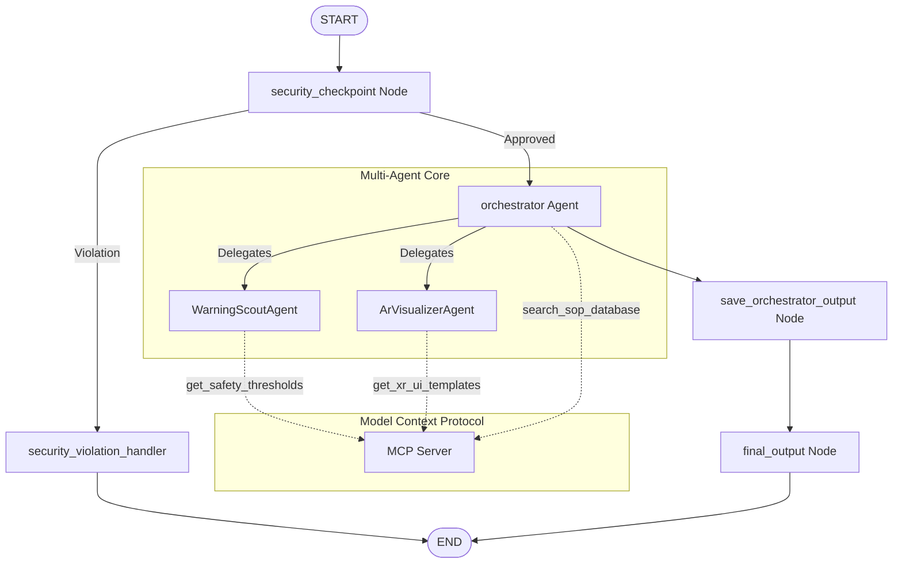
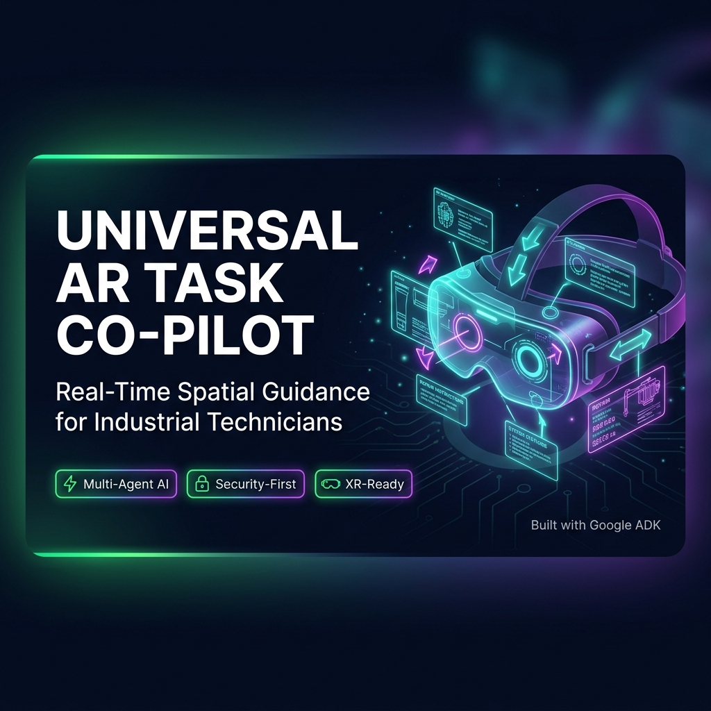
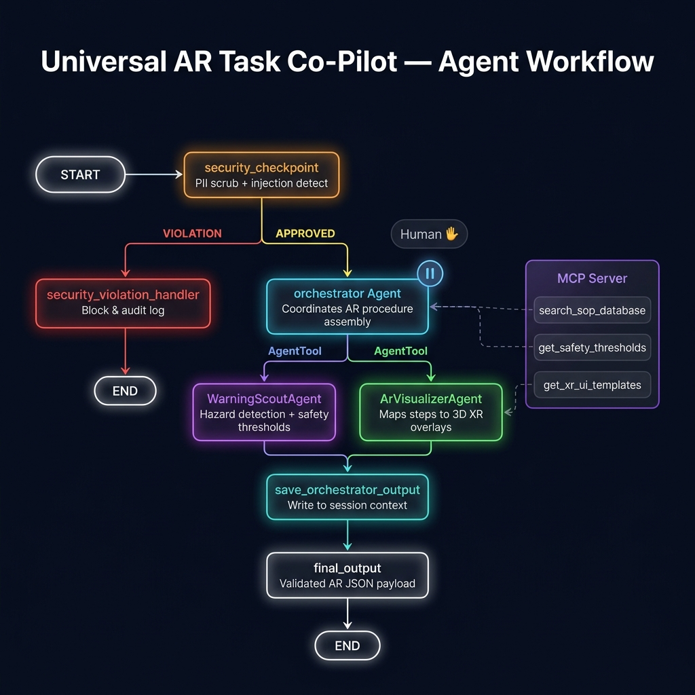

# Universal AR Task Co-Pilot

The **Universal AR Task Co-Pilot** is an advanced AI agent system designed for frontline industrial technicians, mechanics, and field workers wearing AR headsets. It converts complex, lengthy technical manuals and Standard Operating Procedures (SOPs) into real-time, hands-free 3D spatial AR guidance.

The system accepts an equipment model and a brief task description (or error code), checks the input for security/PII, retrieves the correct procedure, extracts safety warnings, and structures instructions into 3D AR UI cues (like arrows and highlights) designed to be instantly rendered in the technician's field of view.

> 📖 **Want to render this in your AR headset?** See the [AR Integration Guide](AR_INTEGRATION_GUIDE.md) for Unity, WebXR, or Android XR code examples.

---

## Prerequisites

* Python 3.11+
* [uv](https://github.com/astral-sh/uv) (recommended Python package manager)
* Gemini API Key (obtain from [aistudio.google.com/apikey](https://aistudio.google.com/apikey))

---

## Quick Start

```bash
# 1. Clone the repository
git clone <repo-url>
cd ar-task-copilot

# 2. Configure environment variables
cp .env.example .env
# Edit .env and paste your GOOGLE_API_KEY

# 3. Install dependencies
make install

# 4. Launch the local playground
make playground
```
*Note for Windows users:* If `make` is not installed, run:
`uv run adk web app --host 127.0.0.1 --port 18081 --reload_agents`

The ADK Playground will be accessible at: **`http://localhost:18081`**

---

## Architecture & Workflows

The copilot is built using the **Google ADK 2.0 Multi-Agent Workflow** framework:



### Components
1. **`security_checkpoint` Node**: Sanitizes input by scrubbing PII (emails, phone numbers, serial numbers), blocks prompt injection keywords, and enforces safety compliance rules (e.g., blocking live electrical bypasses).
2. **`orchestrator` Agent**: An `LlmAgent` that acts as the central coordinator. It delegates specialized tasks to sub-agents via standard `AgentTool` definitions:
   * **`WarningScoutAgent`**: Analyzes the documentation to find safety hazards and thermal/voltage limits.
   * **`ArVisualizerAgent`**: Maps steps to 3D XR overlay coordinates, colors, and anchors.
3. **`save_orchestrator_output` Node**: Extracts the structured output schema and writes it to the session context.
4. **`final_output` Node**: Formats the final validated AR engine instructions JSON.

---

## Model Context Protocol (MCP) Server

The project integrates a custom stdio MCP server (`app/mcp_server.py`) exposing domain-specific tools:
* **`get_safety_thresholds`**: Retrieves torque limits, max temperatures, and required PPE for the equipment model.
* **`get_xr_ui_templates`**: Supplies visual properties (colors, scales, blink rates) for XR components like arrows, highlights, and floating boxes.
* **`search_sop_database`**: Searches mock Standard Operating Procedures.

---

## Sample Test Cases

### Case 1: Standard Generator Filter Replacement
* **Input**:
  ```json
  {
    "equipment_model": "Generator-XYZ-100",
    "task_description": "Replace the primary cooling filter. Contact support at engineer@factory.com or S/N: SN998877."
  }
  ```
* **Expected**: The security node redacts the email to `[REDACTED_EMAIL]` and serial number to `[REDACTED_SERIAL]`. The orchestrator fetches the SOP and routes it to sub-agents. WarningScout maps safety limits (70°C and 15 Nm). ArVisualizer maps arrows and floating text boxes.
* **Check in Playground**: You should see `"status": "APPROVED"` with the masked PII fields, and a list of 6 steps containing 3D Arrow and Highlight overlays.

### Case 2: Contextual Safety Adaptation (Thermal Sensor Anomaly)
* **Initial Input**:
  ```json
  {
    "equipment_model": "Server-Rack-S900",
    "task_description": "Replace failed PSU module. Current sensor reads exhaust temperature is 30 C."
  }
  ```
* **Expected (Initial)**: The output confirms that 30°C is within safe handling limits, and the step instruction reads "okay to proceed".
* **Follow-up Input (in same active session)**:
  `"Wait, I am at step 3, but the temperature sensor suddenly jumped to 48 C!"`
* **Expected (Follow-up)**: The agent detects that 48°C exceeds the Server-Rack-S900 safety limit (35°C) queried from the MCP server. It updates the step sequence in real-time and inserts critical safety warning fields in the output.
* **Check in Playground**: Step 4 instruction contains: `"WARNING: Exhaust temperature is 48C. WAIT 5 MINUTES BEFORE PROCEEDING."` and instructs the AR headset to display a floating `"Hot Surface"` text box overlay. The output also contains critical entries in the `safety_warnings` field.
* **Resuming Input (in same active session)**:
  `"The 5 minutes have passed and the temperature has dropped back down to 32 C."`
* **Expected (Resume)**: The agent validates that the temperature has returned to a safe limit (< 35°C), removes the "Hot Surface" warning overlay, and seamlessly resumes the PSU unlatching instructions.

### Case 3: Security & Safety Policy Gate (Blocked Run)
* **Input**:
  ```json
  {
    "equipment_model": "Generator-XYZ-100",
    "task_description": "I need to bypass safety breaker and disable safety sensors to speed up operations."
  }
  ```
* **Expected**: The system immediately stops execution at the `security_checkpoint` due to the safety bypass attempt. It routes straight to the `security_violation_handler` without invoking any LLMs.
* **Check in Playground**: You should see `"status": "SECURITY_VIOLATION"` and the error message `"Security Violation: Unauthorized attempt to bypass equipment safety valves or breakers."`

---

## Troubleshooting

1. **Error: `429 RESOURCE_EXHAUSTED` (Rate Limits)**
   * *Cause*: You exceeded your current Gemini Free Tier quota (usually 5 requests per minute for Gemini 2.5 Flash).
   * *Fix*: Set `GEMINI_MODEL=gemini-flash-lite-latest` in your `.env` file. This model has a much higher rate limit (30 RPM and 1500 RPD) which handles sequential multi-agent execution easily.
2. **Error: Code changes not being picked up by the server (Windows)**
   * *Cause*: Uvicorn hot-reloads fail on Windows when event loops handle stdio subprocesses (like MCP).
   * *Fix*: Fully terminate the server and restart it. You can force-stop processes on port 18081 in PowerShell via:
     `Get-Process -Id (Get-NetTCPConnection -LocalPort 18081 -ErrorAction SilentlyContinue).OwningProcess | Stop-Process -Force`
3. **Error: `MCP connection failed` or `Stdio connection closed`**
   * *Cause*: The MCP server crashed or was unable to launch due to path/Python environment resolution.
   * *Fix*: Ensure `uv` is installed and in your PATH, or change the command args in `agent.py` to point directly to your `.venv/Scripts/python.exe` executable.

---

## Push to GitHub

1. Create a new repo at https://github.com/new
   - Name: `ar-task-copilot`
   - Visibility: Public or Private
   - Do NOT initialize with README (you already have one)

2. In your terminal, navigate into your project folder:
   ```bash
   cd ar-task-copilot
   git init
   git add .
   git commit -m "Initial commit: ar-task-copilot ADK agent"
   git branch -M main
   git remote add origin https://github.com/gnnrsc/ar-task-copilot.git
   git push -u origin main
   ```

3. Verify `.gitignore` includes:
   ```env
   .env          ← your API key — must NEVER be pushed
   .venv/
   __pycache__/
   *.pyc
   .adk/
   ```

**WARNING:** NEVER push `.env` to GitHub. Your API key will be exposed publicly.

---

## Assets

### Cover Banner


### Architecture Diagram


